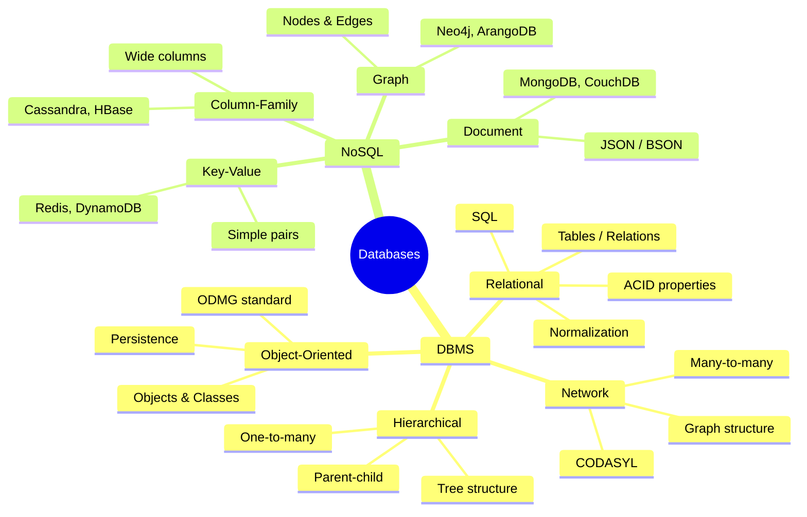

# DBMS Introduction

## What is a Database?
A database is an organized collection of structured data stored electronically. It is designed to store, retrieve, and manage data efficiently.

## What is a DBMS?
A **Database Management System (DBMS)** is software that manages data from a database. It acts as an interface between the database and end users or applications, ensuring data is consistently organised, easily accessible, and secure.

### Key Functions of DBMS
- **Data Definition** — Defining the database structure, data types, relationships, and constraints
- **Data Manipulation** — Inserting, updating, deleting, and retrieving data via queries
- **Data Security** — Enforcing access control to ensure only authorized users access/modify data
- **Data Integrity** — Maintaining accuracy, consistency, and reliability through validation rules
- **Concurrency Control** — Managing simultaneous access by multiple users to prevent conflicts
- **Backup and Recovery** — Mechanisms for backing up data and recovering from failures

---

## DBMS vs File System

| Aspect | DBMS | File-based System |
|--------|------|-------------------|
| Data Organization | Structured tables with relationships | Separate flat files |
| Data Redundancy | Low (uses normalization) | High redundancy |
| Data Integrity | Enforced using constraints | Hard to enforce |
| Security | Strong security and access control | Basic file-level security |
| Concurrency Control | Supports multi-user access safely | No proper concurrency control |
| Data Access | Supports complex queries (SQL) | Limited file operations |
| Backup & Recovery | Automatic and reliable | Manual and less reliable |
| Scalability | Highly scalable | Poor scalability |
| Maintenance | Centralized and easier | Manual and difficult |
| Transactions | Supports ACID properties | No transaction support |

### Need for DBMS over File System
1. **Data Redundancy Control** — Centralized control reduces duplicate data
2. **Data Consistency** — Eliminates inconsistencies from redundancy
3. **Data Sharing** — Multiple users can access same data concurrently
4. **Data Integrity** — Constraints ensure validity and accuracy
5. **Data Security** — Authorization, authentication, and access control
6. **Transaction Support** — ACID properties ensure reliable processing
7. **Backup & Recovery** — Automatic recovery from failures
8. **Concurrency Control** — Consistent results with simultaneous access

---

## DBMS Architecture

### Three Levels of DBMS Architecture

1. **External Level (View Level)**
   - How users view the database
   - Different users have different views
   - Hides irrelevant details from users

2. **Conceptual Level (Logical Level)**
   - Logical view of the entire database
   - Defines tables, attributes, relationships, constraints
   - Independent of any specific DBMS
   - What data is stored and the relationships among them

3. **Internal Level (Physical Level)**
   - Physical storage of data on disk
   - How data is actually stored (files, records, data structures)
   - Deals with storage space allocation, data compression, indexing

### Schema Mapping
The three levels are connected via schema mapping, ensuring changes at one level are accurately reflected in others. This provides **data independence**.

### Data Independence
- **Physical Data Independence** — Changes to physical storage do not affect conceptual schemas
- **Logical Data Independence** — Changes to conceptual schema do not affect external views

---

## DBMS Architecture Types (Tier Architecture)

### 1-Tier Architecture
- Client, server, and database all in one system
- User works directly with the database
- Used for local application development

### 2-Tier Architecture
- Client-server model
- Client (application) directly communicates with database server via ODBC/JDBC
- Server handles query processing and transaction management

### 3-Tier Architecture
- Client → Application Server → Database Server
- Client does not directly communicate with database
- Intermediate layer handles business logic
- Used in large web applications
- Provides better security and scalability

---

## Components of DBMS

### 1. Query Processor
- **DDL Compiler** — Processes Data Definition Language commands
- **DML Compiler** — Processes Data Manipulation Language commands
- **Query Optimizer** — Determines most efficient execution plan

### 2. Storage Manager (Database Control System)
- **Buffer Manager** — Manages data transfer between disk and memory
- **File Manager** — Manages file allocation and storage
- **Authorization & Integrity Manager** — Enforces constraints and security

### 3. Disk Storage
- **Data Files** — Store actual data
- **Data Dictionary** — Stores metadata about database structure
- **Indices** — Provide faster data retrieval

---

## Data Models

### Categories of Data Models

1. **Conceptual Data Models**
   - High-level view of data requirements
   - Example: Entity-Relationship (ER) Model

2. **Representational (Logical) Data Models**
   - Focus on logical structure, not physical storage
   - Example: Relational Model, Hierarchical Model, Network Model

3. **Physical Data Models**
   - Describe how data is stored physically
   - Includes file formats, indexes, access methods
   - Implemented using specific DBMS

## Types of Databases

### Types of Database Models

1. **Hierarchical Model** — Tree-like parent-child structure (one-to-many)
2. **Network Model** — Graph-like structure with many-to-many relationships
3. **Relational Model** — Data stored as tables/relations
4. **Entity-Relationship Model** — Conceptual design using entities and relationships
5. **Object-Oriented Model** — Data stored as objects

---

## Database Schema

A **database schema** is the blueprint that defines how data is organized and stored. It outlines tables, fields, relationships, views, indexes, and other elements.

### Three-Schema Architecture
1. **Physical Schema** — Describes physical storage
2. **Logical Schema** — Describes logical structure (tables, columns, keys, relationships)
3. **View Schema** — User views (subsets of the database)

### Schema vs Instance
- **Schema** — The structure/blueprint (changes rarely)
- **Instance** — The actual data at a particular moment (changes frequently)

---

## Database Administrator (DBA)

The DBA is responsible for:
- Managing database structure and schema
- Enforcing security and access control
- Monitoring performance and tuning
- Backup and recovery planning
- Managing data integrity and constraints
- User management and authorization
