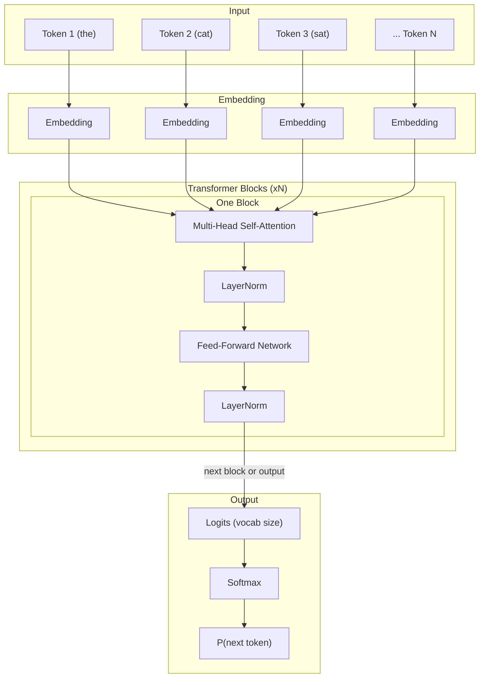

# LLM Fundamentals

> [!summary] TL;DR
> Large Language Models (LLMs) are neural networks trained to predict the next token in a sequence, learning syntax, semantics, and factual knowledge from trillions of tokens of text.

## Definition

A **Large Language Model (LLM)** is a type of neural network — specifically a Transformer — trained on massive corpora of text to model the probability distribution of token sequences. Given a sequence of tokens $(x_1, x_2, \dots, x_{n-1})$, the model learns $P(x_n \mid x_1, \dots, x_{n-1})$, i.e., the conditional probability of the next token. Autoregressive generation repeatedly samples from this distribution to produce new text.

## Example

```
Input:  "The capital of Japan is"
Output: "Tokyo"

Input:  "def fibonacci(n):\n    if n <= 1:"
Output: "    return n"
```

LLMs are used for translation, summarization, code generation, question answering, and as the reasoning engine inside AI agents.

## First Principle Example: Bigram Language Model

The simplest possible "language model" — no neural nets, just counting.

```python
from collections import defaultdict
import random

corpus = ["the cat sat", "the dog ran", "cat sat down"]
tokens = [w for s in corpus for w in s.split()]

counts = defaultdict(lambda: defaultdict(int))
for w1, w2 in zip(tokens, tokens[1:]):
    counts[w1][w2] += 1

def sample(dist):
    total = sum(dist.values())
    r = random.randint(1, total)
    cum = 0
    for k, v in dist.items():
        cum += v
        if r <= cum:
            return k

# Generate
word = "the"
for _ in range(6):
    print(word, end=" ")
    word = sample(counts[word])
# Output: the cat sat down the dog ...
```

**What's happening:**
- **Tokenization:** Split text into words (tokens).
- **Counting:** For every word, count how often each next word follows it.
- **Normalize:** The counts define a probability distribution $P(x_n \mid x_{n-1})$.
- **Sample:** Draw from the distribution to generate.

Real LLMs scale this same principle — replace "counts" with billions of learned parameters in a Transformer, and replace "one previous word" with thousands of previous tokens processed through multi-head self-attention.

## Architecture Diagram



## How It Works (Step by Step)

1. **Tokenization:** Raw text is split into tokens (subwords) using a tokenizer like BPE or WordPiece.
2. **Embedding:** Each token is mapped to a dense vector.
3. **Positional Encoding:** Position information is added so the model knows token order (self-attention is permutation-invariant).
4. **Self-Attention:** Every token attends to every other token — learns context-dependent relationships.
5. **Feed-Forward:** A two-layer MLP per token applies non-linear transformations.
6. **Output:** Final hidden states are projected to vocabulary size; softmax produces a probability distribution.
7. **Generation:** Autoregressive sampling from $P(x_t \mid x_{<t})$ — the predicted token is fed back as input.

---

## 📌 Key Points

- LLMs are **next-token predictors** — no "understanding" in the human sense.
- Scale (model size + data + compute) drives emergent abilities.
- The Transformer's **self-attention** is the key innovation enabling long-range dependencies.
- Inference is autoregressive: $O(n^2)$ complexity per generated token.

## 🔗 Connections

| Relation   | Link                                   |
| ---------- | -------------------------------------- |
| Related to | [[RAG Architecture]]                   |
| Related to | [[How Modern AI Agents work under the hood]] |
| Source     | "Attention is All You Need" (Vaswani et al., 2017) |
| Follow-up  | Build a bigram model; scale to Transformer |

## 🏷️ Tags
#llm #machine-learning #transformer #fundamental #deep-learning
