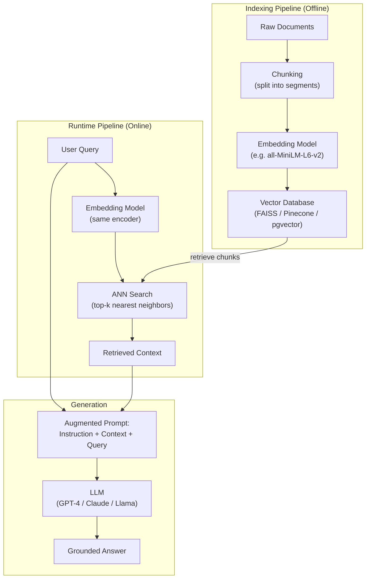

# RAG Architecture

> [!summary] TL;DR
> Retrieval-Augmented Generation (RAG) combines a retrieval system (search) with an LLM (generation) to produce grounded, up-to-date answers without retraining the model.

## Definition

**Retrieval-Augmented Generation (RAG)** is an architectural pattern where an external knowledge base is queried at inference time to retrieve relevant context, which is then injected into the LLM's prompt. This grounds the model's output in verifiable facts and enables it to answer questions about data not in its training set.

**The formula:** `RAG = Retriever + Generator`

Where:
- **Retriever:** Embeds the query, finds top-k similar chunks from a vector database.
- **Generator:** An LLM that receives `[instruction] + [retrieved context] + [user query]` and produces a grounded answer.

## Example

```
User: "What was the revenue in Q3 2025?"

System: [Retrieves relevant financial documents]
  Context: "Q3 2025 revenue was $12.4B, up 18% YoY..."
  Prompt: "Answer based on: <context> Q3 2025 revenue was $12.4B... </context>
           Question: What was the revenue in Q3 2025?"

Output: "Revenue in Q3 2025 was $12.4 billion, an 18% increase year-over-year."
```

## First Principle Example: Naive RAG from Scratch

No neural networks — just TF-IDF + string templates to illustrate the pattern.

```python
from collections import Counter
import math

# Knowledge base: raw text chunks
knowledge_base = [
    "Python is a high-level programming language.",
    "Python was created by Guido van Rossum in 1991.",
    "RAG stands for Retrieval-Augmented Generation.",
    "Transformers use self-attention mechanisms.",
]

# --- Retriever: TF-IDF ---
def tfidf_retrieve(query, docs, top_k=1):
    def tokenize(text):
        return text.lower().split()

    # Build vocabulary
    vocab = set()
    for d in docs:
        vocab.update(tokenize(d))
    vocab = sorted(vocab)
    n_docs = len(docs)

    # Compute TF for each doc
    def tf(tokens, term):
        return tokens.count(term) / len(tokens) if len(tokens) > 0 else 0

    # Compute IDF
    idf = {}
    for term in vocab:
        df = sum(1 for d in docs if term in tokenize(d))
        idf[term] = math.log((n_docs + 1) / (df + 1)) + 1

    # Score query against docs
    q_tokens = tokenize(query)
    scores = []
    for d in docs:
        d_tokens = tokenize(d)
        score = sum(tf(d_tokens, t) * idf.get(t, 0) for t in q_tokens)
        scores.append(score)

    best_idx = sorted(range(len(scores)), key=lambda i: scores[i], reverse=True)[:top_k]
    return [docs[i] for i in best_idx]

# --- Generator: Template-based ---
def generate(context, query):
    return f"Based on the retrieved information: \"{context}\"\nAnswer: {query.strip('?')} is addressed in the context above."

# --- RAG Pipeline ---
query = "Who created Python?"
context_docs = tfidf_retrieve(query, knowledge_base, top_k=1)
context = context_docs[0]
answer = generate(context, query)

print(f"Query: {query}")
print(f"Retrieved: {context}")
print(f"Generated: {answer}")
```

**What's happening:**
1. **Index:** Pre-process the knowledge base into searchable chunks.
2. **Retrieve:** Score chunks by relevance to the query (TF-IDF here; embeddings + cosine similarity in production).
3. **Augment:** Concatenate retrieved context with the original query into a prompt.
4. **Generate:** The LLM (or here, a template) produces a grounded answer.

Real RAG replaces TF-IDF with dense embeddings (sentence-transformers) and the template with a pretrained LLM.

## Architecture Diagram



## How It Works (Step by Step)

### Offline Indexing
1. **Chunking:** Split documents into fixed-size chunks (256–512 tokens) with overlap to preserve context boundaries.
2. **Embedding:** Each chunk is passed through a dense embedding model to produce a vector.
3. **Indexing:** Vectors are stored in a vector DB (FAISS, Pinecone, pgvector) with an ANN index for fast retrieval.

### Online Query
1. **Encode query:** The same embedding model converts the user's query into a vector.
2. **ANN Search:** Approximate Nearest Neighbor search finds the top-k most similar chunk vectors.
3. **Augment prompt:** Retrieved chunks are inserted into a prompt template:
   ```
   Use the following context to answer the question.
   Context: {chunk_1} ... {chunk_k}
   Question: {user_query}
   Answer:
   ```
4. **Generate:** LLM produces the final answer, grounded in the provided context.

## Advanced RAG Patterns

| Pattern | Description |
|---------|-------------|
| **Naive RAG** | Retrieve → Augment → Generate (baseline above) |
| **Hybrid Search** | Combines dense (semantic) + sparse (keyword) retrieval |
| **Reranking** | A cross-encoder reranks retrieved chunks for precision |
| **Self-RAG** | LLM decides *when* to retrieve and *which* chunks to use |
| **Graph RAG** | Builds a knowledge graph from chunks for multi-hop reasoning |

---

## 📌 Key Points

- RAG solves **stale knowledge** and **hallucination** without retraining.
- The retriever's quality (embedding model + chunking strategy) is often the bottleneck.
- Chunk size, overlap, and metadata tagging significantly impact retrieval accuracy.
- RAG is not a model — it's an **architecture pattern** that wraps any LLM.

## 🔗 Connections

| Relation   | Link                                   |
| ---------- | -------------------------------------- |
| Related to | [[LLM Fundamentals]]                   |
| Related to | [[How Modern AI Agents work under the hood]] |
| Source     | "Retrieval-Augmented Generation for Knowledge-Intensive NLP Tasks" (Lewis et al., 2020) |
| Follow-up  | Build a local RAG with sentence-transformers + FAISS |

## 🏷️ Tags
#rag #llm #retrieval #architecture #machine-learning #nlp
