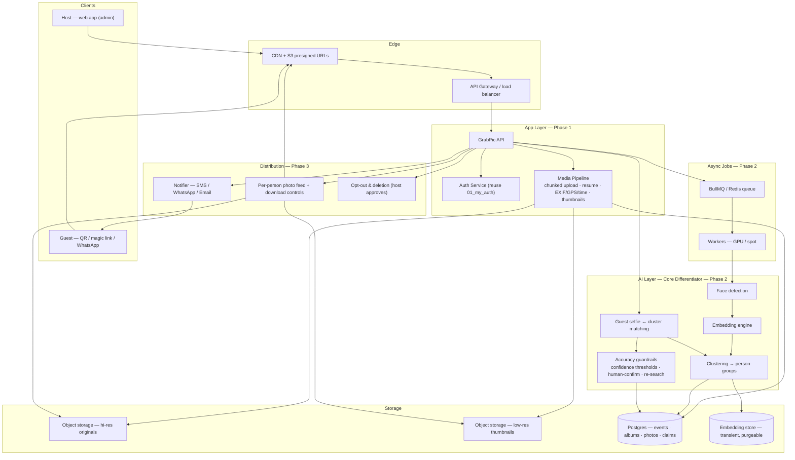

# GrabPic — Event Photo Distribution Platform

> [!summary] TL;DR
> One person photographs an entire event. Instead of manually sending each guest their photos (chaos), the host uploads everything once, and an AI layer finds each person across all photos and notifies them: *"This is you. Claim it."*

## 🎯 Problem

- An event host/photographer captures **every** moment — every guest, every team, every candid.
- Only that **one person holds all the photos**.
- Delivering photos **individually** to each person = manual sorting, messaging, file transfers = chaos.
- Guests don't know a photo of them even exists, or can't find it in a 2,000-photo dump.

## 💡 Solution

A central upload point for the whole event + AI-powered **face identification** that:

1. Host **creates an event**, gets a shareable link/QR code.
2. Host **uploads all photos** (bulk, or auto-sync from camera/SD).
3. AI **groups photos by face + event**, builds a profile for each person.
4. Each guest gets **notified** (link/QR/WhatsApp) → sees *only their own* photos → taps to download originals.
5. Host gets **one-click distribution done** — no manual sending.

## 🧠 AI Layer (core differentiator)

| Capability                      | Detail                                                                                                                        |
| ------------------------------- | ----------------------------------------------------------------------------------------------------------------------------- |
| **Face detection & clustering** | Embeddings + clustering (e.g., `face_recognition`, `insightface`, `deepface`, or cloud Vision) to group photos per person.    |
| **Cost optimization**           | Pre-filter by event + time-window + GPS before face matching; use low-res thumbnails for matching, original only on download. |
| **Auto-notification**           | "These 34 photos are you" — pushed to the guest once they claim the event.                                                    |
| **Privacy**                     | Embeddings are transient; no permanent biometric DB without consent. Deleting a photo/user purges embeddings.                 |

## 🏗️ System Design

> [!tip] Cost & privacy flow
> Photos are **pre-filtered by event + time-window + GPS** before face matching, and matching runs on **thumbnails** — originals are only touched on download. Embeddings are **transient**; deleting a photo/user purges embeddings. (Phase 4 adds monetization: freemium storage tiers, photographer hi-res packs.)

## 🧱 MVP Phases

### 📋 Phase 1 — Core Platform

- [ ] **Events & Albums**: create event → public link + QR code → upload endpoint.
- [ ] **Bulk upload**: web drag-drop, chunked upload, resume, EXIF extraction.
- [ ] **Media pipeline**: image optimization, thumbnails, progressive loading, EXIF/GPS/time parsing.
- [ ] **Auth**: reuse `[[01_my_auth]]` for users/hosts; lightweight "guest" access via magic link / QR (no app install).
- [ ] **Claim flow**: guest opens link → uploads 1–3 selfies (or picks "this is me") → system pulls their photos.

### 🧠 Phase 2 — AI Identification

- [ ] **Face detection & embedding** across event photos.
- [ ] **Clustering** into person-groups; **matching** guest selfie → cluster.
- [ ] **Accuracy guardrails**: confidence thresholds, human-confirm step, "suggest more like this" refinement.
- [ ] **Cost controls**: batch processing queue (BullMQ/Redis), GPU/spot workers, thumbnail-based matching.

### 🤝 Phase 3 — Distribution & UX

- [ ] **Per-person photo feed**: only the guest's matched photos + "request more" loop.
- [ ] **Notification**: SMS/WhatsApp/email invite with their photo count.
- [ ] **Download controls**: free previews w/ watermark → hi-res original on claim/approval.
- [ ] **Opt-out & deletion**: a person can request removal from all photos; host approves.

### 📈 Phase 4 — Monetization & Scale

- [ ] **Freemium**: storage limits per event; paid = more GB + unlimited AI matches.
- [ ] **Photographer plan**: sell hi-res packs, license watermark-free originals.
- [ ] **Corporate/weddings vertical**: host tools, branded galleries.

## ✅ Verdict / Strengths

- **Real problem**: bulk event photo delivery is genuinely painful today.
- **Good wedge**: AI matching → "your photos found automatically" is a compelling hook.
- **Buildable MVP**: no novel science — clustering + notification on solid infra.
- **Synergy**: reuses your auth project.

## ⚠️ Gaps & Improvements (from review)

1. **Privacy is the #1 risk** — tagging people without consent is a legal/social landmine (GDPR, minors, private events). Make it **opt-in**: guests must claim *their own* identity; never auto-publish faces publicly.
2. **Cold start** — the platform is useless until guests actually claim. The **claim link must require zero friction**: no account, QR/WhatsApp tap, selfie or "pick your face from 6 candidates."
3. **Matching accuracy** — event photos are backlit, blurry, occluded. Plan for **false matches** (needs confirm step) and **false negatives** (guest can re-trigger search).
4. **Costs** — face matching on thousands of photos is expensive. Design the pipeline to **batch, pre-filter by time/GPS, and match on thumbnails**, not originals.
5. **Storage economics** — hi-res originals get huge fast. Add CDN, compression tiers, and auto-archive for old events.
6. **Competition exists** — Google Photos shared albums + face groups, PhotoMyEvent, Dropbox. Your **differentiators**: no-app-guest experience, auto-notification, and a *photographer/host* tool, not just a gallery.
7. **Claim-only data model** — don't build a social network. Keep it **transactional**: event → photos → matched guest → download.

## ❓ Open Questions

- Vertical first: **weddings**, **corporate events**, or **sports/teams**? (Sports/teams = easy identifiers via jerseys, but harder face matching at distance.)
- Selfie-based claim vs. "pick me from grid of faces" vs. both?
- Who pays: host, photographer, or premium guest downloads?

## 🔗 Connections

| Relation | Link |
|----------|------|
| Related to | [[Projects]] |
| Reuses | [[01_my_auth]] |
| Follow-up | [[01_my_auth]] |

## 🏷️ Tags

# project # idea # ai # events
