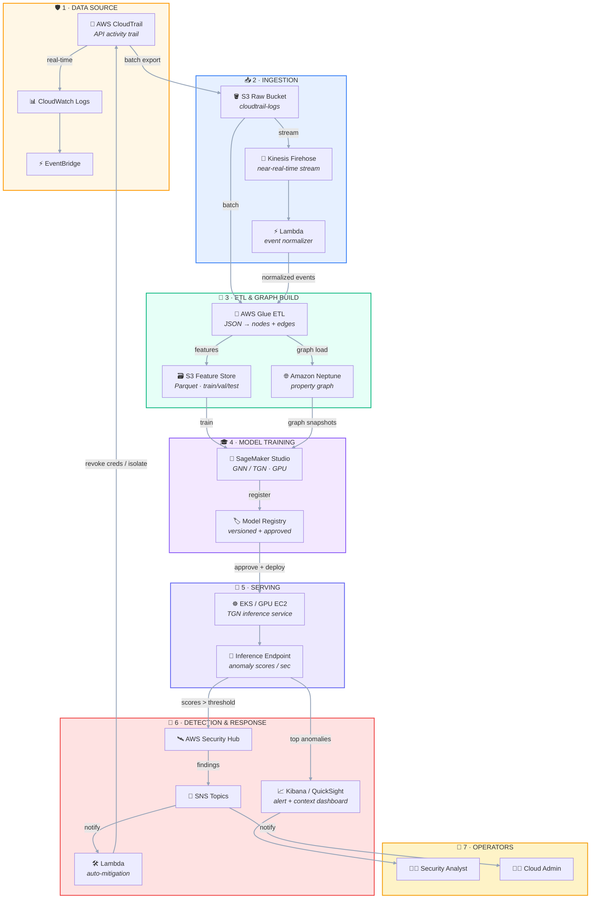
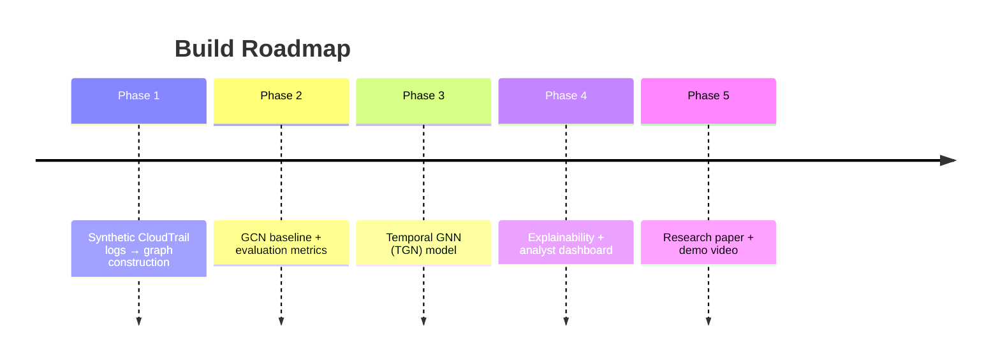

# Graph Neural Network based CloudTrail Threat Detection

> [!abstract] TL;DR
> CloudTrail logs are naturally **graph-structured**: each API call connects an entity (user/role) to a resource. Rule-based and sequential models miss **multi-step, relational attack patterns** — GNNs don't. This project builds a **temporal GNN (TGN)** that scores CloudTrail events for anomalies, reducing alert noise and surfacing high-risk, context-rich detections.

---

## 🗂️ Key Facts

| Field | Value |
|---|---|
| **Problem Statement No.** | `PSAIAC_211` |
| **Domain** | Cyber Security |
| **Technical Complexity** | ⭐⭐⭐⭐⭐ Research-Intensive |
| **Implementation Feasibility** | Moderate |
| **Publication Potential** | ★★★★★ (NDSS / IEEE S&P / ACM CCS / NeurIPS) |
| **AI Component** | Temporal Graph Neural Network (TGN) |
| **Primary SDG** | 🕊️ SDG 16 – Peace, Justice & Strong Institutions |
| **Secondary SDG** | SDG 9 – Industry, Innovation & Infrastructure |

---

## 🎯 Problem Statement

CloudTrail is AWS's service that logs **all API calls** in an account. Analyzing these logs is critical for detecting **insider threats** and **compromised credentials**.

**Why traditional analysis fails:**

- Rule-based systems & sequential models (LSTM) cannot capture **complex, multi-step attack patterns**.
- A single action looks benign in isolation — the *relational context* is what exposes the threat.

> [!quote] Supporting research
> Madireddy *et al.* (2025) — traditional systems *"fail to recognize emerging attack vectors such as privilege escalation or insider misuse"* due to ignoring relational context. Their GNN beat LSTM/GCN baselines on real IAM data.
>
> Nandan *et al.* (2026) — a Temporal Graph Network (TGN) on real AWS CloudTrail logs cut alerts from **thousands → ~1/hour** while surfacing medium/high-risk events.

**Modeling approach:** Nodes = entities (users, roles, resources); Edges = interactions (API calls). A GNN learns **relational + temporal** patterns indicative of threats.

---

## 🌍 SDG Mapping

| SDG | Type | Relevance |
|---|---|---|
| **SDG 16** — Peace, Justice & Strong Institutions | Primary | Resilience of critical institutions via strong cyber infrastructure; aligns with *AI-driven zero-trust access analytics* |
| **SDG 9** — Industry, Innovation & Infrastructure | Secondary | GNN cloud-security solutions are innovation in IT infrastructure |

---

## 📚 Existing Research & State of the Art

- **Cutting-edge area:** GNNs are rapidly entering cybersecurity (2025–26 is the hot window).
- **Madireddy et al. (2025):** GNN for IAM logs → superior detection of insider threats vs. LSTM/GCN baselines.
- **Nandan et al. (2026):** TGN on CloudTrail across five companies → dramatic alert reduction vs. rule-based baselines.
- **Earlier work (2019–2023):** GNNs used for *offline* network intrusion (flow graphs) — little focus on cloud audit logs.

> [!note] Breakthrough insight
> CloudTrail data is *naturally graphical*, and **temporal / attention-based GNNs** adapt to evolving behavior — a very recent (2025–26) breakthrough.

> [!warning] Open-source gap
> AWS GuardDuty is proprietary. **No open-source GNN-based cloud security tool exists** — that's your opportunity.

---

## 🔍 Research Gap

The field is bleeding-edge, leaving clear openings:

1. **Explainability** — analysts distrust black-box GNN alerts.
2. **Scalability** — multi-account / multi-cloud scenarios.
3. **Integration** — combining with network logs & endpoint telemetry.
4. **Adaptivity** — incremental learning as behaviors change.

> 💡 *You could explore* **interpretable GNNs (e.g., GraphLIME)** for CloudTrail, or **incremental/online learning** to keep up with drift.

---

## 💡 Innovation Opportunities

| # | Idea | Description |
|---|---|---|
| 1 | **Explainable GNN** | GNN explainers highlighting which graph events drove an alert |
| 2 | **Edge AI for Logs** | Lightweight graph models on VMs; only forward alerts centrally |
| 3 | **Multi-Agent Simulation** | Attacker vs. benign agents → train RL-based detection |
| 4 | **RAG for Threat Intel** | After GNN flags anomaly, RAG fetches similar AWS docs / threat reports |
| 5 | **Continual Learning** | Adaptive retraining with new threat types |
| 6 | **Hybrid GNN-Transformer** | Feed temporal graph embeddings into a Transformer for extra context |
| 7 | **Digital Twin Cloud Env** | Parallel copy of CloudTrail graph for safe defensive testing |
| 8 | **Privacy-Preserving Logging** | Federated / encrypted GNN across accounts |
| 9 | **Synthetic Data Augmentation** | GANs generate rare attack graphs for training |
| 10 | **Cross-Cloud Graphs** | Link identities across AWS/Azure via federated identity |

---

## ⚙️ Suggested Architecture

**Pipeline stages:**

1. **Log Collection** — CloudTrail logs pushed to S3 or Kinesis.
2. **Data Processing** — Lambda or Glue streaming job transforms logs → graph edges + node features.
3. **Graph Database** — *Optional* Neo4j for entity graph; or in-memory graphs for GNN input.
4. **AI Models** — GPU-enabled server running the GNN (Python/Flask serving predictions).
5. **SIEM Integration** — Alerts forwarded to AWS Security Hub or custom Kibana dashboard.
6. **Cloud-Native** — SageMaker / GPU EC2 for training; S3 for intermediate graphs; CloudWatch alerting.
7. **Security** — Tightly-scoped IAM roles; secure credential storage.
8. **User Interaction** — Analysts view flagged events + their context graph in a dashboard.

---

## 🧰 Tech Stack

| Layer | Choice |
|---|---|
| **Language** | Python |
| **GNN Frameworks** | PyTorch Geometric (Temporal), DGL |
| **Graph Utilities** | NetworkX |
| **Cloud** | AWS (S3, EC2/GPU, SageMaker) |
| **Database** | Neo4j (optional) or Amazon Neptune |
| **AWS Access** | Boto3 |
| **Version Control** | Git / GitHub (private — contains AWS keys) |
| **Deployment** | Docker (GPU support) + optional EKS |

---

## 🧠 AI Component

- **Model:** Temporal GNN (like TGN) scoring each event; attention mechanisms on nodes/edges.
- **Feature Engineering:** Encode entities (users, roles, IPs) and actions (API calls) into embeddings.
- **Pipeline:** CloudTrail logs (JSON) → normalize to graph → batch-feed GNN → anomaly scoring.
- **Training Modes:**
  - *Supervised* — if labeled anomalies available.
  - *Unsupervised / Self-supervised* — link prediction or reconstruction.
- **Metrics:** Precision, Recall, F1 (known attacks); ROC-AUC (anomaly scoring). Alert count per hour as a precision proxy.

---

## 📊 Dataset Availability

| Source | Feasibility |
|---|---|
| **Open data** | ArXiv paper [83] used data from 5 orgs (likely not public). Stand-in: CICIDS flows as a graph |
| **AWS free tier** | Limited CloudTrail use — not realistic for training |
| **Synthetic logs** | Generate CloudTrail-like logs: random IAM actions, or replay attack patterns from research |
| **Public CloudTrail** | ⚠️ **No standard public dataset exists** — rely on synthetic or small live logging |

---

## 📄 Research Papers (2023–2026)

| # | Authors (Year) | Title / Venue | Relevance |
|---|---|---|---|
| 1 | Madireddy *et al.* (2025) | GNN-Based Adaptive Threat Detection for Cloud IAM Logs — *ArXiv* | Core baseline; GNN on IAM logs, superior precision/recall |
| 2 | Nandan *et al.* (2026) | Improved Cloud Threat Detection via GNNs — *ArXiv 2606.28923* | Industry TGN case study; alert reduction |
| 3 | Zhang *et al.* (2025) | Graph Neural Networks for Intrusion Detection — *IEEE TNSM* | Survey + GNN on attack graphs |
| 4 | Lee *et al.* (2024) | Explainable GNNs for Security — *ACM CCS Workshop* | Interpreting GNN alerts |
| 5 | Ferretti *et al.* (2024) | Federated Anomaly Detection in Cloud — *ACM CloudSec* | Cross-account collaborative learning |
| 6 | Patel *et al.* (2023) | Applying RAG to Threat Hunting — *USENIX WOOT* | LLM enrichment of SIEM alerts |
| 7 | Kumar *et al.* (2023) | Temporal Graph Networks in Security Analytics — *NeurIPS WS* | TGN intro for cybersecurity |
| 8 | Davis *et al.* (2025) | Edge Deployment of Security Analytics — *IEEE IoT* | Running anomaly models at the edge |
| 9 | Suzuki *et al.* (2023) | CloudTrail Insights with ML — *AWS Security Blog* | Practical ML detection guidance |
| 10 | Ali *et al.* (2025) | GraphLIME: Explaining Graph Models — *KDD* | Method to explain GNN alerts |

---

## 🎯 Evaluation Metrics

| Metric | Purpose |
|---|---|
| **Detection Rate** | True-positive rate for simulated insider/breach scenarios |
| **Precision / F1** | Low false-positive rate is critical — measure F1 |
| **Alert Reduction** | Flagged events/hr vs. baseline rules (as in [83]) |
| **Throughput** | Edges processed/sec; inference latency |
| **Adaptability** | Speed of learning new patterns (online learning) |

---

## ✨ Novel Features

1. **Contextual Threat Visualization** — subgraph of entities/events behind each alert, with GNN attention highlighted.
2. **Multi-Account Correlation** — connect graphs across AWS accounts to catch cross-account lateral movement.
3. **Self-Adaptive Thresholds** — anomaly thresholds adjust to workload / time-of-day → less noise.
4. **Automated Mitigation** — Lambda auto-disables compromised credentials on high-confidence detections.
5. **Threat Fingerprint Database** — library of known attack graph motifs; match new alerts against them.
6. **Interactive Query** — "What led to this alert?" → graph-based reasoning (RAG/LLM-driven UI).
7. **Federated Cloud Threat Intel** — share anonymized attack subgraphs across teams.
8. **Temporal Anomaly Highlighting** — show behavior deviation over time (e.g., hours of activity).
9. **Contextual User Alerts** — Slack/email alerts with auto-generated natural-language explanations.
10. **Simulation Mode** — "what-if" red-team scenarios on stored logs to pre-evaluate defenses.

---

## 📦 Expected Deliverables

- [ ] **Working Software** — GNN detection module processing CloudTrail logs (offline or near-real-time)
- [ ] **GitHub Repository** — graph construction, GNN training, CLI/UI for analysis
- [ ] **Research Paper** — GNN architecture + evaluation (simulated or real data)
- [ ] **Technical Documentation** — ingesting AWS logs, building graphs, running the model
- [ ] **Demo Video** — live deployment on sample logs with alerts + visualizations
- [ ] **Dataset** — sample CloudTrail logs with annotated/simulated incidents

---

## ⚠️ Risks & Mitigations

| Risk | Type | Mitigation |
|---|---|---|
| Noisy logs → inaccurate graph | Technical | Robust parsing + entity resolution (IP/user mapping) |
| GNN overfitting | Technical | Regularization; validate on held-out logs |
| Limited real attack labels | Research | Synthetic attacks (e.g., AWS offensive-security toolkits) for ground truth |
| Voluminous / sensitive logs | Dataset | Sanitize or simulate sample data |
| GNN tuning complexity | Deployment | Start with GCN baseline, then extend to temporal GNN |

---

## 📈 Resume Value

| Area | Value |
|---|---|
| AI/ML | 🔴 Very High (GNN, PyTorch, advanced modeling) |
| Software Engineering | 🟡 Moderate (data engineering, cloud logs) |
| Cybersecurity | 🔴 High (cloud security specialization) |
| Cloud Computing | 🔴 High (AWS infrastructure) |
| Research | 🔴 Very Strong (leading-edge, publishable) |
| Blockchain/Web3 | ⚪ None (unless federated intel uses a ledger) |

---

## 🚀 Future Scope

- Could seed a **PhD** in AI for cybersecurity.
- Potential **startup** product (cloud security SaaS).
- Extend into **open-source** detection tools.
- GNN engine may be **patentable** if a novel architecture emerges.
- Major cloud providers (AWS, Azure, GCP) actively seek advanced threat detection — adoption potential is real.

---

> [!tip] Build-order suggestion

