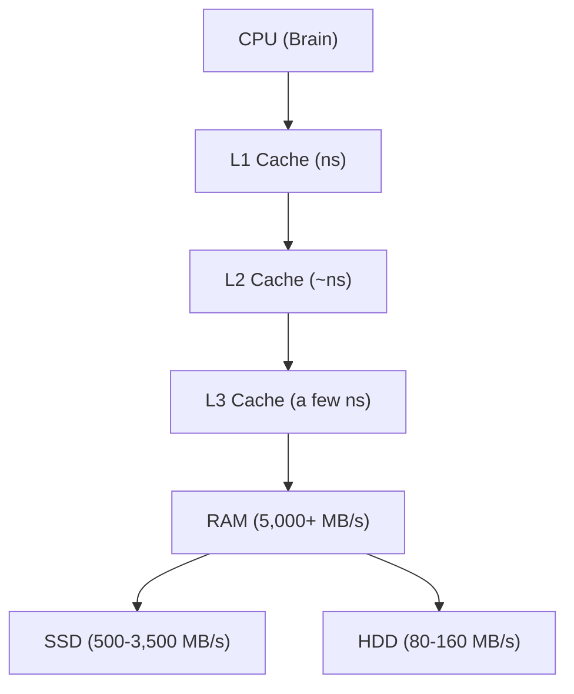
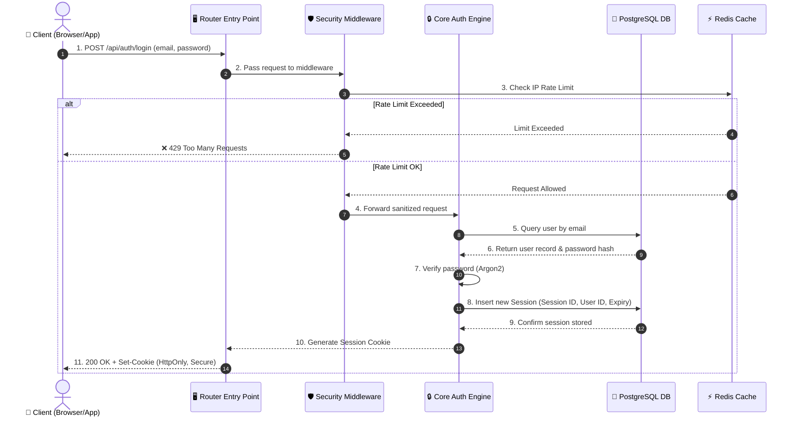
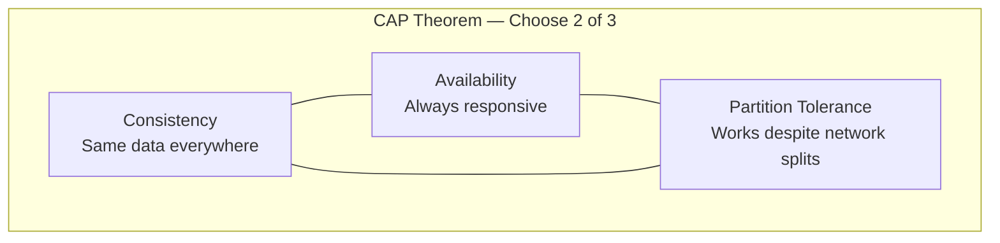
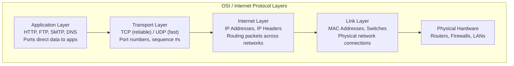
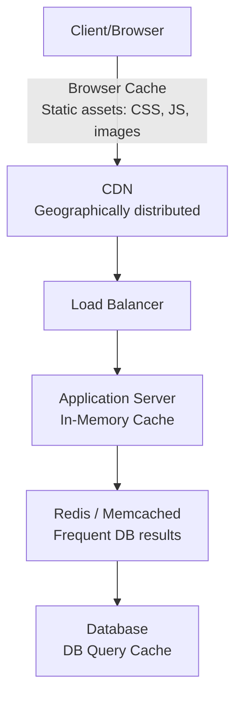
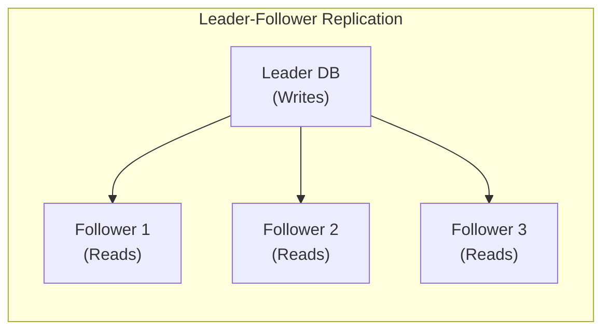
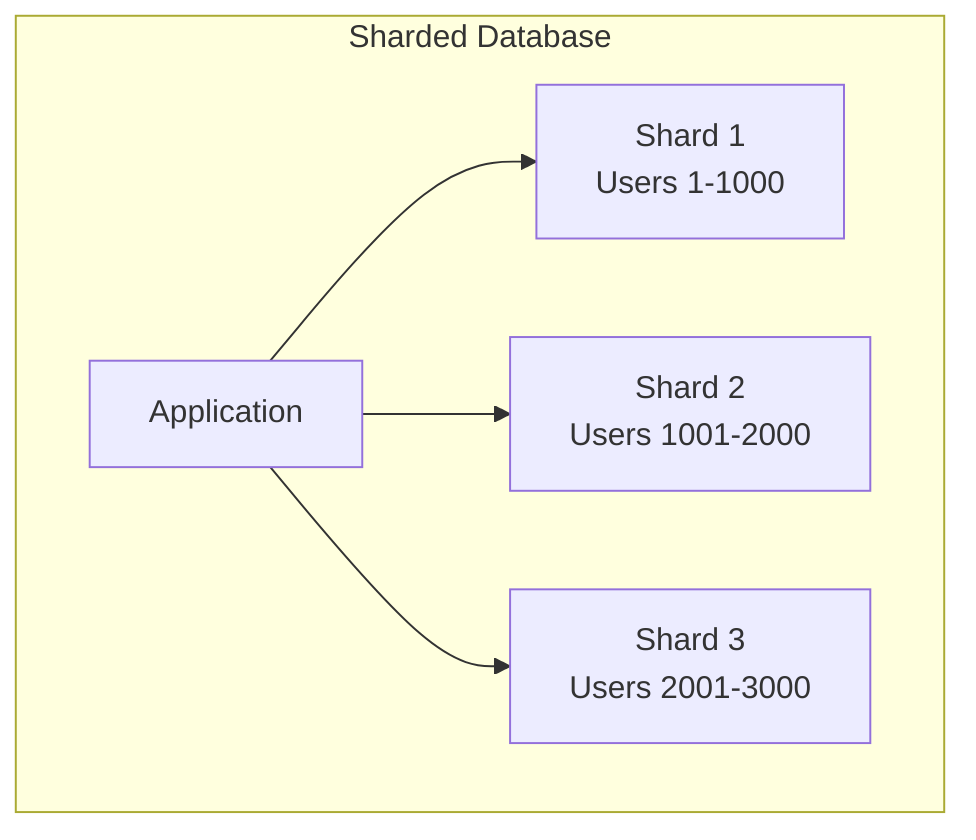

# System Design Concepts

> [!summary] TL;DR
> Full course notes for freeCodeCamp's System Design Concepts Course and Interview Prep by Hayk Simonyan. Covers 11 sections: Computer Architecture, Production App Architecture, Design Requirements (CAP Theorem, Throughput, Latency, SLOs/SLAs), Networking, Application Layer Protocols, API Design, Caching & CDNs, Proxy Servers, Load Balancers, and Databases. Core lesson: system design is about trade-offs, not perfect solutions.

## 📝 Content

### Section 1 — Introduction (00:00)

Companies don't pay six figures for people who just code. They pay for **architectural decisions** — making systems performant, optimizing data storage, and making decisions that affect real customers and real software at scale.

System design is about **trade-offs**. There is no perfect solution — every decision comes with trade-offs:
- Read-optimized systems may perform poorly on writes
- Gaining performance may mean sacrificing simplicity
- Increasing throughput can increase latency
- Strengthening consistency reduces availability

The goal is finding the **best solution for your specific use case**.

---

### Section 2 — Computer Architecture (00:39)

Computers only understand **binary data** (0s and 1s). Understanding the hardware hierarchy is critical for predicting bottlenecks in distributed systems.

#### Memory Units
| Unit | Size |
|------|------|
| Bit | 0 or 1 |
| Byte | 8 bits (one character: 'A', '1') |
| Kilobyte (KB) | ~1,024 Bytes |
| Megabyte (MB) | ~1,024 KB |
| Gigabyte (GB) | ~1,024 MB |
| Terabyte (TB) | ~1,024 GB |

#### The Hardware Hierarchy



**Disk Storage** — Non-volatile. OS, apps, and user files are stored here. HDDs are cheaper but slower (80-160 MB/s). SSDs are faster (500-3,500 MB/s) but more expensive.

**RAM (Random Access Memory)** — Volatile memory. Holds variables, runtime stacks, and active program data. Much faster than disk (5,000+ MB/s). Contents lost on power-off. Consumer devices: 8-32 GB; servers: 128 GB+.

**Cache (L1/L2/L3)** — Ultra-fast, megabyte-scale memory built into the CPU. L1 is the fastest (nanoseconds). CPU searches data in order: L1 → L2 → L3 → RAM.

**CPU (Central Processing Unit)** — The "brain" of the computer. Fetches, decodes, and executes machine code. High-level languages must be compiled into machine code (0s and 1s) for the CPU to understand.

**Motherboard** — The central hub connecting all components (CPU, RAM, storage) and providing data pathways.

> **Key insight for system design:** This hierarchy is the rationale behind caching. Placing frequently accessed data in faster layers (RAM, cache) dramatically reduces average access time.

---

### Section 3 — Production App Architecture (04:22)

Behind every production app is a world of architecture, testing, monitoring, and security measures.



#### CI/CD Pipeline
Continuous Integration and Continuous Deployment automates code going from repository → tests → production without manual intervention. Configured with platforms like **Jenkins** or **GitHub Actions**.

#### Load Balancer / Reverse Proxy
Tools like **nginx** distribute user requests evenly across multiple servers, preventing any single server from becoming a bottleneck.

#### External Storage
Databases run on **separate servers** connected via network — isolated from production servers. The web tier and data tier can scale independently.

#### Logging, Monitoring & Alerting
- **Backend logging/monitoring:** PM2
- **Frontend error capture:** Sentry (real-time error reporting)
- Logs are stored on external services, not the production server
- **Alerting service** detects failing requests/anomalies → sends push notifications to users
- Modern practice: integrate alerts directly into **Slack** channels for immediate response

#### Debugging in Production — The Golden Rule
1. **Log Diving** — Identify the issue through logs
2. **Replicate in Staging** — Never debug directly in production
3. **Hotfix** — Quick temporary fix, then permanent solution later

---

### Section 4 — Design Requirements: CAP Theorem, Throughput, Latency, SLOs/SLAs (07:12)

#### CAP Theorem (Brewer's Theorem)

In a distributed system, you can achieve only **two of three** guarantees simultaneously:

| Property | Meaning | Analogy |
|----------|---------|---------|
| **C**onsistency | All nodes see the same data at the same time | Google Docs — one person edits, everyone sees it instantly |
| **A**vailability | Every request gets a response (success or failure) | A 24/7 online shopping mall — always accessible |
| **P**artition Tolerance | System continues operating despite network failures | Group chat — one person disconnects, others keep chatting |



**Real-world choices:**
- **Banking systems → CP** (sacrifice availability for financial accuracy; transactions may take longer but must be correct)
- **Social media feeds → AP** (allow slight inconsistency for always-on responses; you might see a stale like count)

#### Availability

Measured as uptime percentage. The golden target is **"Five 9's" (99.999%)**.

| Availability Level | Annual Allowed Downtime |
|:------------------:|:----------------------:|
| 99% (Two 9's) | ~3.65 days |
| 99.9% (Three 9's) | ~8.76 hours |
| 99.99% (Four 9's) | ~52.56 minutes |
| 99.999% (Five 9's) | ~5.26 minutes |

#### SLO vs SLA

- **SLO (Service Level Objective)** — Internal performance targets. E.g., "99.9% of web service requests must respond within 300ms."
- **SLA (Service Level Agreement)** — A formal contract with customers that defines the minimum level of service. Violations require refunds or compensation.

#### Throughput vs Latency

| Metric | Unit | Definition |
|--------|------|------------|
| Server Throughput | RPS (Requests Per Second) | Number of requests a server processes per second |
| Database Throughput | QPS (Queries Per Second) | Number of queries a DB processes per second |
| Data Throughput | Bytes/sec | Data transfer rate of a network or system |
| Latency | ms | Response time for a single request |

**Trade-off relationship:** Increasing throughput (e.g., via batch processing) can increase latency for individual requests. You must find the right balance for your use case.

#### Resilience Strategies
- **Redundancy** — Keep backup systems on standby at all times
- **Fault Tolerance** — Prepare for unexpected failures or attacks
- **Graceful Degradation** — Maintain core functionality even when some features are unavailable

---

### Section 5 — Networking: TCP, UDP, DNS, IP Addresses & IP Headers (14:40)

#### The Internet Protocol Suite (Layered Model)



#### IP Addresses
- **IPv4** — 32-bit address (~4 billion addresses — running out)
- **IPv6** — 128-bit address (transition in progress)
- **Public IP** — Unique across the internet
- **Private IP** — Unique within a local network
- **Static IP** — Permanently assigned
- **Dynamic IP** — Changes over time (common for residential connections)

#### IP Packets & Headers
When two computers communicate, they send/receive **packets of data**. Each packet contains an **IP Header** with:
- Sender's IP address
- Receiver's IP address
- Protocol information

The data in these packets is formatted according to specific **Application Protocol Data** (e.g., HTTP for web browsing).

#### TCP vs UDP

| Feature | TCP (Transmission Control Protocol) | UDP (User Datagram Protocol) |
|---------|-------------------------------------|-------------------------------|
| Connection | Connection-oriented | Connectionless |
| Reliability | Guaranteed delivery, retransmission on loss | No guarantee — fire and forget |
| Ordering | Ordered delivery (sequence numbers) | No ordering |
| Speed | Slower (overhead for reliability) | Faster |
| Key Mechanism | 3-way handshake (SYN → SYN-ACK → ACK) | No handshake |
| Use Cases | Web browsing, file transfer, email | Video calls, live streaming, gaming, VoIP |

**TCP 3-Way Handshake:**
1. Client sends **SYN** (synchronize) packet
2. Server responds with **SYN-ACK**
3. Client sends **ACK** — connection established

#### DNS (Domain Name System)

The internet's phone book — translates human-readable domain names (google.com) into IP addresses.

**DNS Resolution Chain:**
```
Browser Cache → OS Cache → Recursive Resolver → Root Server → TLD Server → Authoritative Server
```

**DNS Record Types:**
- **A Record** — Maps domain to IPv4 address
- **AAAA Record** — Maps domain to IPv6 address

**Oversight:** ICANN (Internet Corporation for Assigned Names and Numbers) coordinates the global IP address space and DNS system. Domain registrars (Namecheap, GoDaddy) are accredited by ICANN.

**Ports:** Combined with IP addresses, ports create unique identifiers for network services:
- Port 80 → HTTP
- Port 443 → HTTPS
- Port 22 → SSH
- Port 53 → DNS

---

### Section 6 — Application Layer Protocols: HTTP, WebSockets, WebRTC, MQTT (19:03)

Application protocols sit at the top of the network stack (above TCP/UDP). They define how applications exchange data across a network.

| Protocol | Type | Use Case | Key Feature |
|----------|------|----------|-------------|
| **HTTP/HTTPS** | Request-Response | Web APIs, REST | Stateless, text-based, methods (GET/POST/PUT/DELETE) |
| **WebSockets** | Full-duplex persistent | Real-time apps, chat, notifications | Long-lived connection, server push |
| **WebRTC** | Peer-to-peer | Video/voice calls, file sharing | Browser-to-browser, no plugins, low latency |
| **MQTT** | Publish-Subscribe | IoT devices | Lightweight, 2-byte overhead, 3 QoS levels, low bandwidth |
| **AMQP** | Message-oriented middleware | Enterprise messaging, RabbitMQ | Robust, secure, advanced routing |
| **SMTP** | Email transmission | Sending emails | Standard protocol for email delivery |
| **FTP** | File transfer | Uploading/downloading files | Built on TCP |

#### HTTP (Hypertext Transfer Protocol)
- Standard protocol for most web APIs
- Follows a **request-response model**
- **Stateless** — each request is independent; server stores no context between requests
- Uses status codes: `200 OK`, `404 Not Found`, `500 Internal Server Error`
- Methods: GET (fetch), POST (create), PUT (update/replace), PATCH (partial update), DELETE (remove)

#### WebSockets
- Provides **full-duplex communication** over a single long-lived TCP connection
- Allows servers to **push real-time updates** to clients
- Far more efficient than HTTP polling for constant updates
- Ideal for: chat apps, live dashboards, collaborative editors, multiplayer games, notifications

#### WebRTC (Web Real-Time Communication)
- Enables **browser-to-browser** voice calling, video chat, and file sharing without plugins
- Uses **peer-to-peer** architecture
- Essential for video conferencing, live streaming
- Works with STUN/TURN servers for NAT traversal

#### MQTT (Message Queuing Telemetry Transport)
- **Lightweight** messaging protocol for constrained devices (IoT)
- Optimized for **high-latency or unreliable networks**
- Three **QoS (Quality of Service)** levels: 0 (at most once), 1 (at least once), 2 (exactly once)
- Publish/subscribe model with a central broker

---

### Section 7 — API Design: REST, GraphQL, gRPC (24:01)

An **API (Application Programming Interface)** is a contract that defines:
- What requests can be made
- What format they take
- What responses to expect
- What methods are available

A well-designed API **hides implementation details** while exposing clean functionality.

| Feature | REST | GraphQL | gRPC |
|---------|------|---------|------|
| Data Format | JSON | JSON | Protocol Buffers (binary) |
| Protocol | HTTP/1.1 | HTTP | HTTP/2 |
| Endpoint Model | Multiple endpoints (e.g., `/users`, `/posts`) | Single endpoint (`/graphql`) | Service methods in `.proto` files |
| Data Fetching | Fixed response structure | Client specifies exact fields | Defined by service contracts |
| Caching | Native HTTP caching (headers) | Complex caching | Not designed for caching |
| Streaming | Limited (polling) | Subscriptions | Bidirectional streaming |
| Best For | Public APIs, web/mobile apps | Complex UIs with varied data needs | Internal microservice communication |

#### REST (Representational State Transfer)
- **Resource-based** — each URL represents a resource (`/users/123`)
- **Stateless** — each request contains everything needed
- Uses standard HTTP methods
- Supports HTTP caching through headers
- Most common API style
- overfetching / under-fetching

#### GraphQL
- Clients request **exactly the data they need** — nothing more
- Solves **over-fetching** (getting too much data) and **under-fetching** (needing multiple requests)
- Single endpoint for all operations
- **Trade-off:** Increases server complexity, makes caching difficult

#### gRPC (Google Remote Procedure Call)
- High-performance framework using **Protocol Buffers** (binary serialization)
- Methods defined in `.proto` files
- Supports **bidirectional streaming** over HTTP/2
- Preferred for **internal service-to-service** communication where efficiency matters

**API Design Best Practices:**
- Choose the right communication protocol (HTTP, WebSockets, etc.)
- Choose the right data transport mechanism (JSON, Protocol Buffers)
- Implement security: rate limiting, authentication, input validation
- Handle errors gracefully with consistent error formats
- Use proper HTTP status codes

---

### Section 8 — Caching & CDNs (29:19)

Often the bottleneck isn't the web server — it's the **database server**. Caching temporarily stores data (often in RAM) to serve future requests faster while reducing database load.

#### Caching Layers



**Where caching happens:**
1. **Browser Cache** — Stores static assets (CSS, JS, images) on the client side
2. **CDN (Content Delivery Network)** — Network of geographically distributed servers that cache content closer to users
3. **Application Cache** — In-memory caches (Redis, Memcached) store frequent DB query results
4. **Database Query Cache** — Caches identical query results at the database level

#### Cache Invalidation Strategies

Keeping cache and database in sync is the hardest problem in caching.

| Strategy | Behavior | Pros | Cons |
|----------|----------|------|------|
| **Write-Through** | Update cache AND database simultaneously on every write | High consistency, data never stale | Higher write latency |
| **Write-Back** | Update cache first, synchronize with DB later (in batches) | Very fast writes | Risk of data loss if cache crashes before DB sync |
| **Write-Around** | Write directly to DB; cache is populated only on read | Good for infrequently read data | Cache miss penalty on first read |
| **Cache-Aside** | App checks cache first; on miss, loads from DB and populates cache | Most common pattern, flexible | Cache miss adds latency |

#### Eviction Policies (when cache is full)
- **LRU (Least Recently Used)** — Evicts data not used for the longest time
- **LFU (Least Frequently Used)** — Evicts data accessed least often
- **FIFO (First In, First Out)** — Evicts oldest entries first
- **TTL (Time To Live)** — Automatically expires entries after a set time

#### CDN (Content Delivery Network)
CDNs are networks of servers spread across multiple locations to store and serve web content.

**CDN delivery modes:**
- **Pull-based** — CDN fetches data from the origin server on the first user request, then caches it
- **Push-based** — Origin server pushes data to the CDN beforehand

**Popular CDN providers:** Cloudflare, Amazon CloudFront, Google Cloud CDN, Microsoft Azure CDN

**CDN use cases as reverse proxies:**
- Retrieve content from origin server and cache it closer to users
- Reduce latency for global audiences
- Handle traffic spikes

---

### Section 9 — Proxy Servers: Forward & Reverse Proxies (36:33)

A **proxy server** acts as an intermediary between a client requesting a resource and the server providing that resource. It receives requests, forwards them, and returns responses.

#### Types of Proxy Servers
1. **Forward Proxy** — Sits in front of clients
2. **Reverse Proxy** — Sits in front of servers
3. **Open Proxy** — Publicly accessible, often for anonymizing browsing
4. **Transparent Proxy** — Visible to client, no modification, used for caching/filtering
5. **Anonymous Proxy** — Identifiable as proxy but hides original IP
6. **Distorting Proxy** — Provides a fake original IP
7. **High Anonymity Proxy (Elite Proxy)** — Extremely difficult to detect as a proxy

#### Forward Proxy

```
Client → [Forward Proxy] → Internet → Target Server
```

- Sits **between clients** and external servers
- **Hides the client's IP address** — the target server sees the proxy's IP
- Uses: anonymity, content filtering, monitoring employee internet, caching frequently accessed content, bypassing geo-restrictions
- Example: VPNs, Instagram proxies for managing multiple accounts

#### Reverse Proxy

```
Client → [Reverse Proxy] → Backend Servers
```

- Sits **in front of web servers**, intercepting requests from the internet
- **Hides the server's identity** — client interacts only with the proxy
- Uses: load balancing, web acceleration, SSL termination/offloading, caching, security (DDoS protection, WAF)

| Aspect | Forward Proxy | Reverse Proxy |
|--------|---------------|---------------|
| Position | In front of clients | In front of servers |
| Hides | Client's IP address | Server's IP address |
| Acts on behalf of | The client | The server |
| Use cases | Anonymity, content filtering | Load balancing, security, caching, SSL offloading |
| Examples | VPN, corporate network proxy | nginx, HAProxy, AWS ELB, Cloudflare |

#### Real-World Reverse Proxy Examples
- **Load Balancers** (nginx, HAProxy) — Distribute traffic across servers
- **CDNs** (Cloudflare, CloudFront) — Cache and deliver content globally
- **WAF (Web Application Firewall)** — Inspect traffic, block attacks
- **SSL Offloading** — Handle encryption/decryption to offload backend servers

---

### Section 10 — Load Balancers (42:36)

Load balancers distribute incoming network traffic across multiple servers to ensure no single server bears too much load. They increase capacity and reliability of applications.

#### Load Balancing Algorithms

| Algorithm | How It Works | Best For |
|-----------|-------------|----------|
| **Round Robin** | Requests distributed sequentially, cycling through servers | Simple setups, servers of equal capacity |
| **Least Connections** | Routes to server with fewest open connections | Variable session lengths |
| **Least Response Time** | Routes to server with lowest response time + fewest connections | Latency-sensitive apps |
| **IP Hash** | Hash of client IP determines which server gets the request | Session persistence (same client → same server) |
| **Weighted Round Robin** | Servers assigned weights based on capacity; proportionally distributed | Heterogeneous server capacities |
| **Weighted Least Connections** | Least connections + server weights | Mixed capacity + variable sessions |
| **Geographical (Geo-routing)** | Routes to server geographically closest to user | Global services, latency reduction |
| **Consistent Hashing** | Hash function distributes requests with minimal remapping when servers change | Distributed caching, minimizing cache misses |

#### Health Checks
Load balancers run **continuous health checks** on servers. If a server fails, the load balancer automatically stops sending traffic to it and resumes when it recovers.

#### Load Balancer Types
- **Software:** nginx, HAProxy (configurable, flexible)
- **Hardware:** F5 (proprietary, expensive)
- **Cloud-Managed:** AWS Elastic Load Balancing (ELB), Google Cloud Load Balancing (auto-scaling, managed)

#### The Load Balancer as a Single Point of Failure
The load balancer itself can be a **single point of failure**. If it goes down, all servers become unavailable.

**Mitigation strategies:**
1. **Redundancy** — Run multiple load balancer instances (active-passive or active-active failover)
2. **Health Checks & Monitoring** — Continuous monitoring with auto-failover
3. **Auto-scaling & Self-Healing** — Automatically replace failed instances
4. **DNS Failover** — Use DNS to reroute traffic if the primary load balancer fails

#### Layer 4 vs Layer 7 Load Balancing
- **Layer 4 (Transport Layer)** — Routes based on IP and TCP/UDP ports; faster, less intelligent
- **Layer 7 (Application Layer)** — Inspects HTTP headers, cookies, URLs; more features but higher overhead

---

### Section 11 — Databases: Sharding, Replication, ACID, Vertical & Horizontal Scaling (48:05)

The database is often the **primary bottleneck** in large-scale systems. Understanding database design is critical.

#### The Single Server Setup → Separation of Tiers

Start with a single server handling both web and database. As traffic grows, **separate the web tier from the data tier** so each can scale independently.

```
User → DNS → Server (App + DB on same machine)
```
→ Scales to:
```
User → DNS → Load Balancer → [App Server 1, App Server 2, App Server 3] → Database Server (separate)
```

#### SQL vs NoSQL — How to Choose

| Feature | SQL (Relational) | NoSQL (Non-Relational) |
|---------|-----------------|----------------------|
| **Schema** | Fixed, table-based (rows & columns) | Flexible schema (documents, key-value, graphs, wide-column) |
| **Examples** | PostgreSQL, MySQL, Oracle | MongoDB (document), Redis (KV), Cassandra (wide-column), Neo4j (graph) |
| **Scaling** | Vertical (scale up) | Horizontal (scale out) |
| **Transactions** | ACID (Atomicity, Consistency, Isolation, Durability) | BASE (Basically Available, Soft state, Eventual consistency) |
| **Relationships** | Strong — supports complex joins | Weak — denormalized, embedded data |
| **Best For** | Financial systems, e-commerce, structured data with clear relationships | High-volume unstructured data, real-time feeds, IoT, rapid writes |

**Rule of thumb:** SQL when you need strong consistency and structured relationships. NoSQL when you need flexibility, scalability, and fast writes.

#### ACID Properties (SQL)

| Property | Meaning |
|----------|---------|
| **A**tomicity | Transaction completes fully or not at all (binary) |
| **C**onsistency | Database remains in a valid state before and after transaction |
| **I**solation | Concurrent transactions don't interfere with each other |
| **D**urability | Committed data persists even after system failure |

#### Vertical vs Horizontal Scaling

**Vertical Scaling (Scale Up):**
- Add more power to existing server (more RAM, faster CPU, bigger disk)
- Simple to implement
- Has a **hard ceiling** — you can only add so much to one machine
- Single point of failure remains

**Horizontal Scaling (Scale Out):**
- Add more servers to the pool
- Provides **fault tolerance** — if one server dies, others keep serving
- Provides **flexibility** — add servers as demand grows
- Introduces complexity: load balancing, data consistency, distributed coordination

#### Database Replication

Creating multiple copies (replicas) of a database across different servers.

**Benefits:**
- **High availability** — if one DB goes down, the app switches to another replica
- **Read scalability** — multiple databases can serve read queries
- **Fault tolerance**

**Replication Methods:**

| Method | How It Works | Pros | Cons |
|--------|-------------|------|------|
| **Leader-Follower (Master-Slave)** | Leader handles all writes; propagates to followers; followers handle reads | Simple, good read scaling | Writes bottlenecked on leader |
| **Leader-Leader (Multi-Master)** | Multiple nodes accept writes; changes propagate between them | Write scaling, no single point of write failure | Complex conflict resolution |



**Sync vs Async Replication:**
- **Synchronous** — Changes committed to leader AND replicas simultaneously; guarantees consistency, but slower writes
- **Asynchronous** — Changes propagated in background; faster writes, but temporary inconsistency risk

**Conflict Resolution for Leader-Leader:**
- Timestamp-based: latest timestamp wins
- Last-write-wins (LWW): most recent write overrides
- Custom conflict resolution logic (application-specific)

#### Database Sharding (Horizontal Partitioning)

When a database grows too large for a single server, **sharding** distributes data across multiple servers.



**Shard Key** — Determines how data is assigned to shards:

| Method | How It Works | Pros | Cons |
|--------|-------------|------|------|
| **Range-based** | Data partitioned by ranges of shard key (e.g., IDs 1-1000 → Shard 1) | Simple, good for range queries | Risk of hot spots (uneven distribution) |
| **Hash-based** | Hash function applied to shard key to determine shard | Even distribution | Range queries become inefficient |

**Real-world examples:**
- E-commerce: shard by country/region (users from same region → same shard → lower latency)
- Social media: shard by user ID (efficient access to individual user data)

**SQL vs NoSQL sharding:**
- Traditional SQL databases don't offer sharding out of the box — you implement the logic yourself
- Many NoSQL databases (MongoDB, Cassandra) have **built-in sharding support**

#### Summary: Replication vs Sharding

| | Replication | Sharding |
|--|-------------|----------|
| **Purpose** | High availability, read scaling | Horizontal scaling of data |
| **Data** | Full copy on each node | Subset of data on each node |
| **Write Scaling** | Limited (Leader-Leader helps) | Yes |
| **Complexity** | Moderate | High |
| **Common Combo** | Replication within each shard | Both techniques used together |

---

## 📌 Key Points

- System design is about **trade-offs**, not perfect solutions
- **CAP Theorem:** in a distributed system, choose 2 of 3 (Consistency, Availability, Partition Tolerance) — banking → CP, social → AP
- **Availability target:** 99.999% (Five 9's) = ~5 minutes downtime/year
- **SLO** = internal performance targets; **SLA** = formal customer contract with penalties
- **Throughput and latency** have an inverse relationship — increasing one affects the other
- **Caching** can be applied at every layer (browser → CDN → app cache → DB cache); hardest part is invalidation
- **Write-through** cache gives consistency at a latency cost; **write-back** is fast but risks data loss
- **CDNs** cache content geographically — pull-based (fetch on first request) or push-based (pre-push content)
- **Forward proxy** hides the client; **reverse proxy** hides the server
- **Reverse proxy** use cases: load balancing, SSL offloading, caching, WAF security
- **Load balancer** algorithms: Round Robin (simplest), Least Connections (variable sessions), IP Hash (session stickiness), Consistent Hashing (cache affinity)
- **Load balancer itself is a SPOF** — use active-passive failover with health checks
- **Layer 4 LB** = IP/TCP routing; **Layer 7 LB** = HTTP-aware routing
- **SQL** = ACID, vertical scaling, fixed schema; **NoSQL** = BASE, horizontal scaling, flexible schema
- **Leader-Follower replication** scales reads; **Leader-Leader** scales writes with conflict resolution complexity
- **Sharding** distributes data across servers via range-based or hash-based shard keys
- **Replication + Sharding** are often used together for both HA and horizontal scale
- Never debug in production → replicate in staging → hotfix
- API designs: **REST** for public APIs, **GraphQL** for complex client queries, **gRPC** for internal microservice IPC
- Application protocols: **HTTP** (request-response), **WebSockets** (real-time bidirectional), **WebRTC** (P2P media), **MQTT** (IoT lightweight)

## 🔗 Connections

| Relation | Link |
|----------|------|
| Related to | [[System Design Interview Prep]] |
| Source | [YouTube: System Design Concepts Course](https://www.youtube.com/watch?v=F2FmTdLtb_4) |
| Follow-up | [[Database Deep Dive]] |
| Instructor | [Hayk Simonyan](https://www.youtube.com/@hayk.simonyan) |

## 📎 Attachments

- [Presentation Slides (Notion)](https://www.notion.so/System-Design-Concepts-Course-and-Interview-Prep-Presentation-Slides-dd8abfd72e3e4b8eb3da402db13018cd)
- [freeCodeCamp Course Article](https://www.freecodecamp.org/news/learn-system-design-principles/)
- [Course Author Article: System Design Explained](https://levelup.gitconnected.com/system-design-explained-apis-databases-caching-cdns-load-balancing-production-infra-93c5d136fe04)

## 🏷️ Tags

#system-design #architecture #networking #databases #caching #load-balancing #CAP-theorem #API-design #interview-prep #computer-architecture #CDN #proxy #replication #sharding #ACID
